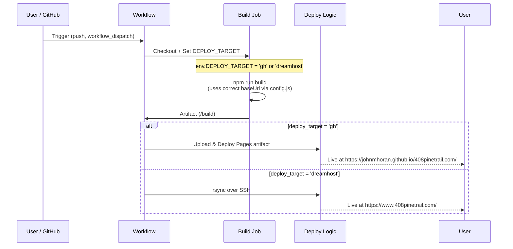

# From Grok 2026-02-20

- This is an excerpt from https://grok.com/c/d78f6e2b-5908-4bd8-a192-37c1c1df791a?rid=578e62a3-3c79-40f1-b05d-b2dca57a4342.

Here are all three ideas I mentioned earlier, expanded with concrete examples so you can pick and choose (or mix) whatever fits your workflow best. They're all aimed at making your multi-target Docusaurus + GitHub Actions setup even cleaner, easier to maintain, or more educational as you keep learning CI/CD patterns.

### 1. A version with a **single deploy job** (instead of two separate ones)

This simplifies the workflow file by removing the split between `deploy-gh-pages` and `deploy-dreamhost`. We use matrix strategy or conditional steps inside one job.

**Why useful to learn from:**
- Fewer jobs = less duplication, easier to read/maintain
- Teaches conditional deployment logic inside steps (very common pattern)

**Modified snippet (replace the two deploy jobs with this):**

```yaml
deploy:
  name: Deploy to selected target
  needs: build
  if: github.event_name != 'pull_request'
  runs-on: ubuntu-latest
  steps:
    - name: Download build artifact
      uses: actions/download-artifact@v4
      with:
        name: docusaurus-build
        path: build

    - name: Deploy to GitHub Pages
      if: needs.build.outputs.deploy_target == 'gh'
      uses: actions/upload-pages-artifact@v3
      with:
        path: build
    - name: Deploy GitHub Pages site
      if: needs.build.outputs.deploy_target == 'gh'
      uses: actions/deploy-pages@v4

    - name: Setup SSH for DreamHost
      if: needs.build.outputs.deploy_target == 'dreamhost'
      run: |
        mkdir -p ~/.ssh
        echo "${{ secrets.DREAMHOST_SSH_KEY }}" > ~/.ssh/id_rsa
        chmod 600 ~/.ssh/id_rsa
        ssh-keyscan -H ${{ secrets.DREAMHOST_HOST }} >> ~/.ssh/known_hosts

    - name: Deploy to DreamHost via rsync
      if: needs.build.outputs.deploy_target == 'dreamhost'
      run: |
        rsync -avz --delete build/ \
          ${{ secrets.DREAMHOST_USER }}@${{ secrets.DREAMHOST_HOST }}:${{ secrets.DREAMHOST_PATH }}/
```

You can even go further and use a matrix if you ever add a third target:

```yaml
deploy:
  needs: build
  if: github.event_name != 'pull_request'
  runs-on: ubuntu-latest
  strategy:
    matrix:
      target: [gh, dreamhost]
  steps:
    # ... conditional steps based on matrix.target ...
```

### 2. A **Mermaid sequence diagram** (instead of the previous flowchart)

This style shows the *time/order* of operations more clearly — great for understanding the sequence and decision points.



Paste this into any Mermaid-compatible viewer (GitHub README, mermaid.live, Obsidian, etc.) to see it rendered interactively.

### 3. A small, copy-pasteable **README table** explaining usage & results

This is perfect for documenting the setup for yourself or future-you (or collaborators).

```markdown
## Deployment Targets & How to Trigger Them

| Trigger method                  | DEPLOY_TARGET | baseUrl                     | Resulting live URL                                      | When to use                              |
|---------------------------------|---------------|-----------------------------|------------------------------------------------------------------|------------------------------------------|
| `git push` to `main`            | `gh`          | `/408pinetrail.com/`        | https://johnmhoran.github.io/408pinetrail.com/                   | Normal development flow                  |
| Workflow dispatch → "gh"        | `gh`          | `/408pinetrail.com/`        | https://johnmhoran.github.io/408pinetrail.com/                   | Manual redeploy to GitHub Pages          |
| Workflow dispatch → "dreamhost" | `dreamhost`   | `/`                         | https://www.408pinetrail.com/                                    | Promote changes to production domain     |
| Local: `npm run start` / `build`| `local`       | `/`                         | http://localhost:3000 (or build output)                          | Development & testing                    |
| Pull Request (any)              | `gh`          | `/408pinetrail.com/`        | Build only (no deploy) – useful for PR previews if configured   | Code review & validation                 |

**Quick manual deploy commands (via GitHub UI):**
- Go to Actions → "Build & Deploy Docusaurus Site" → Run workflow
- Choose target: `gh` or `dreamhost`
```

These three pieces together give you:
- A leaner workflow file (option 1)
- A clearer visual of the timing/sequence (option 2)
- Excellent self-documentation (option 3)

Feel free to take any/all of them and tweak further. If you'd like me to combine any two (e.g. single-job YAML + updated table), or help test one of them against your current secrets/setup, just say the word. Happy building! 🚀
